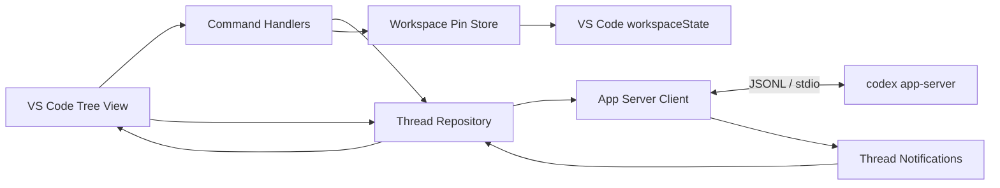

# Codex Thread Manager for VS Code 実装計画書

- 作成日: 2026-07-14
- 状態: Phase 6 完了（品質保証と非公開 VSIX 配布準備）
- 仮称: `Codex Thread Manager`
- 調査環境: Windows / Codex CLI `0.142.3`

## 1. 目的

現在の VS Code ワークスペースに紐づく Codex スレッドを、エディターのサイドバーから整理できる拡張機能を作る。

MVP では次の操作を提供する。

1. ワークスペースのスレッド一覧表示
2. スレッドのピン留め・ピン留め解除
3. スレッド名の変更
4. スレッドのアーカイブ
5. アーカイブ済みスレッドの表示・復元

「Codex の管理」は、MVP ではスレッド管理に限定する。認証設定、モデル設定、プロンプト送信、ターンの閲覧・実行などは対象外とする。

MVP 完了後の次バージョンでは、一覧から既存スレッドを選択して会話画面を開き、そのスレッドで会話を継続できる機能を追加する。詳細は「12. 次バージョン計画（vNext）: スレッド会話画面」に分離して記載する。

## 2. 調査結果と採用方針

### 2.1 現在のワークスペース

- ディレクトリは空で、既存ソースや設定ファイルはない。
- Git リポジトリはまだ初期化されていない。
- 既存実装との互換性制約はないため、TypeScript 製の新規 VS Code 拡張として構成する。

### 2.2 Codex との接続方法

Codex の保存ファイルを直接読み書きせず、公式の `codex app-server` を使用する。

App Server は Codex の VS Code 拡張などのリッチクライアント向けインターフェースで、標準入出力では JSONL 形式の双方向メッセージを扱う。接続後は `initialize` リクエストと `initialized` 通知によるハンドシェイクが必須である。

MVP で使用するプロトコルは次のとおり。

| 機能 | App Server メソッド／保存先 | 補足 |
| --- | --- | --- |
| 一覧 | `thread/list` | `cwd`、`archived`、ページング、並び順を指定可能 |
| 詳細取得 | `thread/read` | 必要時のみ使用し、ターン本文は取得しない |
| 名前変更 | `thread/name/set` | 成功後に一覧を更新 |
| アーカイブ | `thread/archive` | 成功後にアクティブ一覧から除外 |
| 復元 | `thread/unarchive` | アーカイブ一覧の補助操作として提供 |
| ピン留め | VS Code `workspaceState` | 現行プロトコルにピン留め API がないため拡張側で管理 |

利用する主な Thread フィールドは `id`、`name`、`preview`、`cwd`、`createdAt`、`updatedAt`、`recencyAt`、`status`、`source` とする。

App Server の型は Codex CLI のバージョンに依存する。開発時にバージョンを固定した CLI から `codex app-server generate-ts` で生成した型をリポジトリへ固定し、生成元バージョンと更新用スクリプトも保存する。実行時にはレスポンスを無条件に信用せず、MVP で使う境界データを検証する。

生成元 CLI と実行時 CLI のバージョンは分離して扱う。完全一致だけを理由に接続を拒否せず、`initialize`、必要なメソッド、レスポンス境界検証が成功するかを実際の互換性判定に使う。バージョン差は Output Channel に記録し、動作可能なら警告、必須メソッドまたは境界データが非互換なら明確なエラーと更新手順を表示する。

### 2.3 「ワークスペースのスレッド」の定義

MVP では、Thread の `cwd` が VS Code のいずれかの `workspaceFolders[].uri.fsPath` と一致するスレッドを「現在のワークスペースのスレッド」と定義する。

- マルチルートワークスペースでは全ルートを `cwd` フィルターへ渡す。
- フォルダーを開いていない VS Code ウィンドウでは空状態を表示する。
- `cwd` がワークスペース配下のサブディレクトリであるスレッドまで含める機能は、App Server の `cwd` フィルターが完全一致であるため MVP 外とする。必要なら、後続版で全件走査とパス境界判定を追加する。
- 既定の対話系スレッドだけを対象とし、サブエージェントや `codex exec` の履歴を混在させない。将来、表示対象を設定で切り替えられるようにする。

### 2.4 ピン留めの意味

ピン留めは Codex 全体の状態ではなく、現在の VS Code ワークスペースに対する表示設定とする。

- 保存形式: `workspaceState` 内のスレッド ID 配列
- 表示順: ピン留め順を維持し、新しくピン留めしたものを先頭にする
- ワークスペースごとに独立して保存する
- アーカイブ時はピン留めを解除する
- 存在しないスレッド ID は完全更新時に除去する
- 他の Codex クライアントや別の VS Code ワークスペースとは同期しない

これは App Server にネイティブなピン留め機能が追加された場合に、移行可能な薄い `PinStore` として実装する。

## 3. ユーザー体験

### 3.1 画面構成

Activity Bar に Codex Thread Manager 用の View Container を追加し、ネイティブな Tree View を 1 つ配置する。Webview は使用しない。

Tree View のルートは次の最大 3 グループとする。

1. `ピン留め`
2. `最近のスレッド`
3. `アーカイブ`

`アーカイブ` は初期状態で折りたたみ、展開されたときに遅延取得する。アクティブ一覧は更新日時の新しい順で表示する。件数が多い場合はページ単位で取得し、`さらに表示…` 項目から続きを読み込む。

### 3.2 スレッド行

- ラベル: `name`、なければ `preview` の先頭行、どちらもなければ `無題のスレッド`
- 説明: 最終更新の相対時刻と実行状態
- アイコン: 通常、ピン留め、実行中、エラー、アーカイブを Codicon で区別
- ツールチップ: フルタイトル、`cwd`、作成／更新日時、ソース、スレッド ID
- コンテキストメニュー: ピン留め、名前変更、アーカイブの最大 3 操作

### 3.3 コマンド

| コマンド ID（予定） | 動作 |
| --- | --- |
| `codexThreadManager.refresh` | 現在の一覧を再取得 |
| `codexThreadManager.pin` | 選択スレッドをピン留め |
| `codexThreadManager.unpin` | ピン留めを解除 |
| `codexThreadManager.rename` | 入力ボックスで名前を変更 |
| `codexThreadManager.archive` | スレッドをアーカイブ |
| `codexThreadManager.unarchive` | アーカイブ済みスレッドを復元 |

名前変更では現在名を初期値にし、前後の空白を除いた空文字を拒否する。アーカイブは復元可能なので確認ダイアログを挟まず、成功通知に `元に戻す` アクションを付ける。

### 3.4 空状態とエラー表示

次の状態は Tree View の Welcome/Message と通知で明確に案内する。

- ワークスペースフォルダーがない
- 対象スレッドがない
- `codex` コマンドが見つからない
- Codex CLI が App Server に対応していない
- App Server の起動・初期化に失敗した
- 接続が終了した、タイムアウトした
- 名前変更・アーカイブなど個別操作が失敗した

エラー通知には、設定を開く、再接続、再読み込みなど、その場で可能な次の操作を付ける。詳細は専用 Output Channel に記録するが、スレッド本文や認証情報はログへ出さない。

## 4. アーキテクチャ



### 4.1 モジュール案

```text
src/
  extension.ts
  codex/
    appServerClient.ts
    jsonlTransport.ts
    threadRepository.ts
    protocol/
      generated/
      guards.ts
  commands/
    registerCommands.ts
    threadCommands.ts
  state/
    pinStore.ts
  views/
    threadTreeItem.ts
    threadTreeProvider.ts
  common/
    errors.ts
    disposable.ts
scripts/
  generate-protocol.mjs
test/
  unit/
  integration/
    fake-app-server/
  vscode/
```

### 4.2 App Server Client

- Node.js の `child_process.spawn` で `codex app-server --listen stdio://` を起動する。
- シェルを介さず、実行ファイルと引数を分離して渡す。
- 接続は拡張プロセス内で 1 本だけ保持し、必要になるまで遅延起動する。
- 連番リクエスト ID と `Map` で応答を対応付ける。
- リクエストごとにタイムアウトとキャンセルを扱う。
- stdout は行単位に JSON として解析し、stderr は診断ログとして扱う。
- `thread/name/updated`、`thread/archived`、`thread/unarchived`、`thread/status/changed` を受けて該当項目を更新する。
- 型生成元の CLI バージョンと実行時に解決した CLI のバージョンを診断情報として保持する。
- CLI のバージョン文字列だけで互換性を断定せず、ハンドシェイク、必須メソッド、境界検証の結果を優先する。
- 次バージョンの会話機能で必要になる Server Request を追加できるよう、request/response/notification の振り分けを拡張可能な構造にする。MVP で未対応の Server Request を受けた場合は、安全なエラーを返して保留し続けない。
- プロセス終了時は保留中リクエストをすべて失敗させ、UI を再接続可能な状態へ戻す。
- `deactivate` でストリーム、イベント購読、子プロセスを確実に破棄する。

### 4.3 Thread Repository

App Server のプロトコル型を View から隠し、次を担当する。

- アクティブ／アーカイブ一覧のページング
- ワークスペース `cwd` フィルター
- Thread から表示モデルへの変換
- 同時更新の世代管理と古いレスポンスの破棄
- 同じスレッドへの重複操作の抑止
- コマンド成功後とサーバー通知後のキャッシュ更新
- ピン留め情報との結合と並び替え

### 4.4 VS Code 拡張としての実行場所

`extensionKind: ["workspace"]` とし、Remote SSH、Dev Container、WSL ではワークスペース側で実行する。これにより `cwd` と Codex CLI の実行環境を一致させる。

- リモート環境では、その環境内に Codex CLI が必要
- VS Code for the Web は子プロセスを起動できないため MVP 非対応
- Virtual Workspace は MVP 非対応
- Workspace Trust がない状態では起動を制限し、信頼後の再読み込みを案内

## 5. 設定項目

MVP で公開する設定は最小限にする。

| 設定 | 既定値 | 用途 |
| --- | --- | --- |
| `codexThreadManager.codexPath` | `codex` | 自動解決できない場合に Codex CLI の実行ファイルまたは公式 npm shim を指定 |
| `codexThreadManager.pageSize` | `50` | 一覧 1 回あたりの取得件数 |

開発用または診断用の内部設定を一般ユーザー向け設定に混ぜない。CLI の最小対応バージョンは、実装時の互換テストで確定し、`README.md` と起動時診断に明記する。

## 6. セキュリティとデータ取り扱い

- `~/.codex` 配下の DB、JSONL、認証ファイルを直接操作しない。
- OpenAI API キーを拡張側で要求・保存しない。既存の Codex 認証状態を利用する。
- `codexPath` はシェル文字列へ連結せず、実行ファイルとして起動する。
- App Server は stdio のローカル子プロセスとしてのみ起動し、WebSocket ポートを公開しない。
- Output Channel にスレッド本文、入力内容、トークン、環境変数を記録しない。
- アーカイブは可逆操作として実装し、削除機能は提供しない。
- App Server のうち必要なメソッドだけをラップし、任意メソッド実行機能は UI や設定から公開しない。

## 7. 実装フェーズ

### Phase 1: プロジェクト基盤

- npm / TypeScript ベースの VS Code 拡張を作成
- `package.json` の View、Command、Menu、Configuration を定義
- esbuild による拡張バンドル、ESLint、型チェックを設定
- Extension Development Host 用の launch/task 設定を追加
- README、CHANGELOG、LICENSE、`.gitignore` の初期版を追加

完了条件: 空の Tree View を持つ拡張が Extension Development Host で起動する。

### Phase 2: App Server 接続

- 現行 CLI から TypeScript プロトコル型を生成し、更新スクリプトを追加
- JSONL transport と request/response/notification 処理を実装
- initialize ハンドシェイク、タイムアウト、終了処理、Output Channel を実装
- `codexPath` と互換性エラーを診断できるようにする

完了条件: 実ユーザーデータを変更せず、`thread/list` の応答を取得できる。

### Phase 2.1: CLI 解決と互換性診断の強化

Phase 2 の実機確認で、通常の PowerShell と VS Code Extension Host では `PATH` とコマンド解決結果が異なり、PowerShell の npm shim は見つかってもシェルを介さない `spawn` では起動できないケースを確認した。Phase 3 の前に次を実施する。

- 実行ファイルと先行引数を表す `CodexCommand` と、それを生成する `CodexExecutableResolver` を追加する。
- 解決順序を、明示的な `codexPath`、`PATH` 上のネイティブ実行ファイル、公式 npm shim の順に定義する。
- Windows の公式 npm shim はシェルで実行せず、隣接する npm package manifest の `bin` エントリを解決して `node` と引数を分離して起動する。
- 他の VS Code 拡張のバージョン付きインストールパスや内部ファイルを探索・固定参照しない。
- 解決した CLI のパス、`codex --version`、型生成元バージョンを Output Channel の診断へ記録する。ホームディレクトリなど不要なパス情報は UI 通知へ出さない。
- 生成元と実行時のバージョンが異なる場合は警告するが、それだけでは拒否しない。`initialize`、`thread/list`、レスポンス境界検証の成功を互換性の基準にする。
- 必須メソッド未対応またはレスポンス非互換時は、検出したバージョン、生成元バージョン、設定を開く／再試行する操作を案内する。
- 型生成に使う開発用 CLI のバージョンを再現可能な形で固定し、更新時は生成差分と互換性テストを同じ変更に含める。

完了条件: Windows の公式 npm インストールを含む標準的な CLI 配置を既定設定で安全に解決でき、生成元と異なる互換 CLI でも `thread/list` が成功し、非互換 CLI では理由と対処が表示される。

実装結果（2026-07-15）:

- ネイティブ実行ファイルを優先し、Windows の公式 npm shim をmanifest検証後に `node` と先行引数へ分解するresolverを追加した。
- 型生成CLIをexactな開発依存 `@openai/codex@0.144.2` に固定し、生成元バージョン定数もスナップショットと同時生成するようにした。
- 実行時 `0.142.3`／生成元 `0.144.2` の公式npm CLIで、実データを変更しない `initialize` と `thread/list(limit: 1)` の成功を確認した。
- 必須メソッド未対応と不正な境界レスポンスを統合テストし、両バージョンと設定／再試行の対処を返すことを確認した。

### Phase 3: 読み取り専用の一覧

- Thread Repository と TreeDataProvider を実装
- 単一／マルチルート `cwd` フィルターを実装
- ピン留め・最近・アーカイブのグループを追加
- ページング、手動更新、空状態、状態アイコン、ツールチップを実装
- ワークスペースフォルダー変更時に一覧を再取得

完了条件: 現在のワークスペースのアクティブ／アーカイブ済みスレッドだけを表示できる。

実装結果（2026-07-16）:

- Thread Repository を追加し、App Server の `thread/list` から取得した Thread を Tree View 用の表示モデルへ変換するようにした。
- 単一／マルチルートの `cwd` フィルターを維持したまま、アクティブとアーカイブの初回ページおよび追加ページを読み取れるようにした。
- Tree View に実スレッド行、状態アイコン、相対更新時刻、ツールチップ、`Load more…` 項目、空状態を表示するようにした。
- ワークスペースフォルダーや設定変更時にリポジトリのスナップショットを更新し、古いレスポンスを世代で破棄する既存制御へ統合した。

### Phase 4: ピン留め

- `PinStore` を `workspaceState` 上に実装
- ピン留め／解除コマンドとコンテキスト表示条件を追加
- 再読み込み後の順序復元、無効 ID の掃除を実装

完了条件: ピン留め状態が同じワークスペースで永続化され、別ワークスペースに漏れない。

実装結果（2026-07-16）:

- `PinStore` を追加し、`workspaceState` にピン留め ID を新規ピン優先の順序で保存するようにした。
- ピン留め済みスレッドを専用グループへ昇格し、最近のスレッドからは重複表示しないようにした。
- アクティブスレッドのコンテキストメニューにピン留め／解除を追加し、アーカイブ済みスレッドには表示しないようにした。
- 全ページ読み込み済みの更新時に、存在しないピン留め ID を掃除するようにした。

### Phase 5: 名前変更とアーカイブ

- 名前変更入力、検証、`thread/name/set` 呼び出しを実装
- `thread/archive`、成功通知、Undo を実装
- アーカイブ一覧からの `thread/unarchive` を実装
- 操作中の二重実行防止と失敗時の UI 復元を実装
- App Server 通知による差分更新を実装

完了条件: 操作結果が Codex 側に保存され、再取得後も一致する。

実装結果（2026-07-16）:

- 名前変更コマンドを実装し、空白除去後の空文字を拒否して `thread/name/set` へ保存するようにした。
- アーカイブコマンドを実装し、成功通知から `Undo` で `thread/unarchive` を呼び出せるようにした。
- アーカイブ一覧の復元コマンドを `thread/unarchive` に接続し、一覧キャッシュへ即時反映するようにした。
- スレッド単位の操作中フラグで重複実行を防ぎ、失敗時は App Server 側の変更前キャッシュを維持してエラーを表示するようにした。
- `thread/name/updated`、`thread/archived`、`thread/unarchived`、`thread/status/changed` 通知を受けて Tree View を更新するようにした。

### Phase 6: 品質保証と配布準備

- 単体、統合、Extension Host テストを追加
- Windows、macOS、Linux、および WSL/Remote の代表環境を確認
- VSIX を生成し、クリーン環境へのインストールを確認
- 利用条件、制約、トラブルシュートを README に記載
- 公開する場合は Marketplace 用メタデータ、アイコン、publisher を確定

完了条件: 後述の受け入れ条件を満たし、VSIX から再現可能に動作する。

実装結果（2026-07-16）:

- JSONL transport、境界検証、CLI resolver、PinStore、Thread Repository、Tree View の単体テストを追加した。
- 偽 App Server による rename/archive/unarchive、通知、タイムアウト、切断、stderr の秘匿化、未対応 Server Request の統合テストを追加した。
- VS Code `1.92.2` を使った Extension Host テストを追加し、View、Command、Menu、Configuration の登録を確認するようにした。
- Windows の Extension Host でテストを実行し、GitHub Actions では Windows、macOS、Linux の品質検証、VSIX 生成、Extension Host テストを行うマトリクスを追加した。
- VSIX の非公開インストール手順、要件、制約、Remote/WSL の注意点、トラブルシュート、手動受け入れチェックリストを文書化した。
- `thread/name/updated` の生成型フィールドとの不一致と、`thread/status/changed` が表示モデルへ反映されない不具合を修正した。
- `esbuild` と `@vscode/vsce` を監査済みの修正版へ更新し、`npm audit` 0 件を確認した。
- Marketplace 公開は予定していないため、公開用 publisher、掲載文、公開操作の整備は省略した。

## 8. テスト計画

### 8.1 単体テスト

- JSONL の分割受信、複数行、壊れた JSON、空行
- initialize 前の送信抑止と正常なハンドシェイク
- リクエスト ID の対応、タイムアウト、プロセス終了、キャンセル
- `thread/list` のページングとアクティブ／アーカイブ分離
- Thread のラベルフォールバックと日時・状態表示
- ピン順序、永続化、解除、無効 ID の除去
- Windows の大文字小文字、区切り文字を含むワークスペースパス
- 同時 refresh で古いレスポンスが UI を上書きしないこと

### 8.2 統合テスト

実ユーザーの Codex データを変更しないよう、偽 App Server プロセスを用意する。

- initialize、list、rename、archive、unarchive の正常系
- サーバー通知による UI 更新
- メソッド未対応、エラー応答、stderr 出力、突然の終了
- 応答遅延と順序入れ替わり
- 空、複数ページ、大量件数

実 Codex CLI を使うスモークテストは opt-in とし、一時的な `CODEX_HOME` を使って一覧取得と接続終了だけを確認する。

### 8.3 VS Code Extension Host テスト

- View とコマンドが登録される
- contextValue に応じて正しいメニューだけが表示される
- `workspaceState` がウィンドウ再読み込み後も復元される
- ワークスペースフォルダー追加・削除で再読込される
- Codex CLI 不在時に案内が表示される
- CLI 解決がネイティブ実行ファイル、空白を含む明示パス、Windows の公式 npm shim で成功する
- PowerShell と Extension Host の `PATH` が異なる場合でも、診断に実際の解決結果が表示される
- 型生成元と実行時の CLI バージョンが異なっても、必須プロトコルが互換なら接続を継続する
- 必須メソッドまたは境界データが非互換なら、安全に停止して両方のバージョンと対処を表示する

## 9. 受け入れ条件

- [x] 現在の VS Code ワークスペースに完全一致する Codex スレッドだけが表示される
- [x] 名前がないスレッドもプレビューまたは代替名で識別できる
- [x] ピン留めしたスレッドが先頭グループへ移動し、ウィンドウ再読み込み後も維持される
- [x] スレッド名の変更が Codex 側へ保存され、一覧へ反映される
- [x] アーカイブしたスレッドがアクティブ一覧から消え、アーカイブ一覧へ移動する
- [x] アーカイブ直後に Undo でき、アーカイブ一覧からも復元できる
- [x] 失敗時にデータを失わず、原因と次の操作がユーザーに示される
- [x] `~/.codex` の内部ファイルを直接変更しない
- [x] 拡張終了時に App Server プロセスと全 Disposable が残らない
- [x] 公式 Codex VS Code 拡張のバージョン付き内部パスへ依存せず、標準的な CLI 配置を解決できる
- [x] 型生成元と実行時の CLI バージョン、および互換性判定結果を診断できる
- [x] CLI バージョンが完全一致しなくても、必須プロトコルが互換なら利用できる
- [x] 単体テスト、統合テスト、型チェック、lint、bundle、VSIX 作成が成功する

## 10. 主なリスクと対策

| リスク | 影響 | 対策 |
| --- | --- | --- |
| App Server が CLI 上で experimental 扱い | CLI 更新で型やメソッドが変わる | 再現可能な型スナップショット、生成元／実行時バージョン表示、境界検証、実メソッドによる互換性テスト |
| シェルと Extension Host で CLI の解決結果が異なる | 開発環境では動くのに拡張から起動できない | `CodexExecutableResolver`、npm shim の非シェル解決、実際の解決結果を診断表示 |
| 公式 VS Code 拡張の内部 CLI を直接参照する | 公式拡張の更新でバージョン付きパスが変わり起動不能になる | 他拡張の内部パスへ依存せず、独立した CLI インストールと `codexPath` を利用 |
| ピン留めが Codex ネイティブ状態ではない | 他クライアントと同期されない | UI と README に「ワークスペースローカル」と明記し、`PinStore` を交換可能にする |
| `cwd` が完全一致のみ | サブディレクトリで開始したスレッドが出ない | MVP の定義を明記し、後続版で配下判定モードを検討 |
| CLI が PATH にない | App Server を起動できない | `codexPath` 設定、起動時診断、設定を開くアクション |
| リモート環境に CLI がない | Remote で動作しない | workspace extension として実行し、リモート側インストールを案内 |
| 大量のスレッド | 初期表示や更新が遅い | ページング、アーカイブ遅延取得、更新キャンセル、キャッシュ |
| 外部クライアントからの変更 | 表示が一時的に古くなる | App Server 通知、View 再表示時更新、手動 refresh |
| 企業環境で未知の clientInfo | 監査ログ上の識別に課題 | 一意な clientInfo を設定し、一般公開・企業利用前に OpenAI の既知クライアント登録要件を確認 |

## 11. MVP で行わないこと

- 新規スレッド作成
- スレッドを開いて会話する機能（次バージョンで実装予定）
- ターン、メッセージ、diff、ツール実行履歴の表示（次バージョンで段階的に実装予定）
- スレッド削除、複数選択、一括アーカイブ
- Codex 認証、モデル、sandbox、MCP、plugin の設定管理
- クラウド専用／ChatGPT 側だけに存在するチャットの管理
- Codex 公式 VS Code 拡張の非公開 API や内部ファイルへの依存
- ピン留めの端末間・クライアント間同期
- VS Code for the Web / Virtual Workspace 対応
- ワークスペース配下の任意サブディレクトリを `cwd` とするスレッドの包含

## 12. 次バージョン計画（vNext）: スレッド会話画面

このセクションは MVP の実装・受け入れ条件には含めない。MVP のスレッド管理機能が安定し、App Server Client の互換テストが通った後に着手する独立した次バージョンの計画とする。

### 12.1 目的とユーザーフロー

既存スレッドの整理から、そのスレッドでの作業再開までを VS Code 内で完結させる。

1. Tree View のスレッド行を選択する
2. `codexThreadManager.openThread` が対象スレッド専用の会話画面をエディター領域に開く
3. 過去のユーザーメッセージ、Codex の応答、主な作業イベントを時系列で表示する
4. 画面下部の入力欄からテキストメッセージを送信する
5. Codex の応答と作業状況をストリーミング表示する
6. 必要な承認や追加質問へ会話画面内で回答する
7. 実行中のターンを停止できる
8. 同じスレッドを再選択した場合は既存の会話タブを再利用する

### 12.2 vNext の対象範囲

vNext の最初のリリースでは、既存スレッドに対するテキスト会話を完成させる。

- 既存スレッドの履歴表示
- 既存スレッドの resume
- テキストメッセージ送信
- Codex メッセージの差分ストリーミング
- ターンの開始、完了、失敗、停止状態の表示
- コマンド実行、ファイル変更、MCP／ツール呼び出しの要約カード
- コマンド実行、ファイル変更、追加権限などの承認・拒否
- Codex からの追加質問への回答
- 実行中ターンの interrupt
- App Server 再接続後の履歴再同期
- VS Code ウィンドウ再読み込み後の会話タブ復元

次の機能は vNext 初版には含めず、会話画面が安定してから検討する。

- 新規スレッド作成
- 画像、ファイル、Skill、mention の入力
- 音声／Realtime 会話
- 完全なターミナルエミュレーター
- 複雑な diff レビュー UI
- サブエージェント専用ナビゲーション
- 複数ターンの同時送信

### 12.3 App Server プロトコル

| 用途 | メソッド／通知 | vNext での扱い |
| --- | --- | --- |
| 履歴取得 | `thread/read` (`includeTurns: true`) | 会話画面の初期表示と再同期に使用 |
| 作業再開 | `thread/resume` | メッセージ送信前に対象スレッドへ再接続 |
| メッセージ送信 | `turn/start` | `threadId` と text input を送信 |
| 実行中の追加入力 | `turn/steer` | 基本送受信の安定後に有効化 |
| ターン停止 | `turn/interrupt` | Stop 操作から `threadId` と `turnId` を送信 |
| メッセージ差分 | `item/agentMessage/delta` | 対象メッセージへ差分を連結 |
| 項目ライフサイクル | `item/started` / `item/completed` | メッセージと作業カードの状態更新 |
| ターンライフサイクル | `turn/started` / `turn/completed` | 入力欄、Stop、エラー表示を更新 |
| 状態変化 | `thread/status/changed` | 他画面や再接続を含む状態同期 |
| 作業進捗 | command/file change/MCP/plan 系通知 | 折りたたみ可能な作業カードへ反映 |
| 承認 | `item/commandExecution/requestApproval`、`item/fileChange/requestApproval`、`item/permissions/requestApproval` | 明示的な承認／拒否 UI を表示して同じ request ID へ応答 |
| 追加質問 | `item/tool/requestUserInput`、`mcpServer/elicitation/request` | 質問形式に応じた入力 UI を表示して応答 |

App Server の Server Request は通知と異なり、クライアントから同じ request ID への応答が必要である。未対応の要求を無視するとターンが停止したままになるため、対応可否を判定し、未対応時は安全に拒否して理由を表示する。実験的 API が必要な要求は、対応 CLI バージョンと capability を確認してから個別に有効化する。

### 12.4 会話画面の設計

会話画面は `WebviewPanel` をエディター領域に開く。App Server への接続、履歴、承認判断は Extension Host が所有し、Webview は表示とユーザー入力だけを担当する。

追加する主なモジュールは次のとおり。

```text
src/
  conversation/
    conversationPanelManager.ts
    conversationSession.ts
    conversationReducer.ts
    conversationViewModel.ts
    approvalController.ts
  webview/
    conversation/
      main.ts
      styles.css
      protocol.ts
```

- `ConversationPanelManager`: thread ID ごとに 1 つのパネルを生成・再利用・復元
- `ConversationSession`: `thread/read`、`thread/resume`、turn 操作、再接続を調整
- `ConversationReducer`: 履歴とストリーミング通知を決定的に ViewModel へ反映
- `ApprovalController`: Server Request の保留、表示、応答、破棄を一元管理
- Webview: メッセージ一覧、composer、Stop、承認／質問 UI、作業カードを描画

Webview と Extension Host の通信は専用の discriminated union で型付けする。Webview から任意の App Server メソッド名やシェルコマンドを渡せる設計にはしない。

表示上の方針は次のとおり。

- ユーザー／Codex メッセージを明確に区別する
- 応答中は同じメッセージへ差分を追記し、完了後に確定する
- コマンド、ファイル変更、ツール呼び出しは既定で要約し、詳細を展開可能にする
- 長い履歴は段階的に描画し、スクロール位置を維持する
- 新着追従はユーザーが最下部付近にいる場合だけ行う
- Markdown とコードブロックを表示する場合は HTML をサニタイズする
- Webview に nonce 付き Content Security Policy と限定した `localResourceRoots` を設定する
- 承認要求は対象コマンド、パス、理由、権限変更の範囲を表示し、承認を既定選択にしない
- 承認待ちでタブを閉じる場合は確認し、自動承認は絶対に行わない

### 12.5 vNext 実装フェーズ

#### vNext Phase A: 読み取り専用会話画面

- スレッド行の選択と `openThread` コマンドを追加
- thread ID ごとの WebviewPanel 管理を実装
- `thread/read(includeTurns: true)` から履歴 ViewModel を生成
- ユーザー／Codex メッセージ、ターン状態、基本作業カードを表示
- パネルの再利用、復元、再読み込みを実装

完了条件: 一覧で選択した正しいスレッドの履歴が、書き込みなしで会話タブに表示される。

#### vNext Phase B: テキスト会話とストリーミング

- `thread/resume` と `turn/start` を実装
- composer の送信、送信中状態、二重送信防止を実装
- メッセージ、item、turn 通知を reducer へ接続
- `turn/interrupt` と Stop UI を実装
- 失敗、接続断、再接続後の履歴再同期を実装

完了条件: 既存スレッドへメッセージを送り、Codex の応答をリアルタイム表示し、必要なら停止できる。

#### vNext Phase C: 承認・質問・作業イベント

- command/file change/permission の承認要求を表示・応答
- 追加質問と MCP elicitation の入力・応答
- コマンド、ファイル変更、MCP、plan の作業カードを実装
- 未対応 Server Request の安全な拒否と診断を実装
- 必要な範囲だけ experimental capability を互換テスト付きで有効化

完了条件: 承認や追加回答が必要な Codex ターンを、別クライアントへ移動せず完了できる。

#### vNext Phase D: 品質保証

- 大量履歴、長時間ストリーミング、複数会話タブを負荷テスト
- Webview メッセージ境界、Markdown、CSP のセキュリティテスト
- キーボード操作、スクリーンリーダー、コントラストを確認
- Windows、macOS、Linux、Remote/WSL で会話を確認
- CLI 更新に対するプロトコル互換テストを追加

完了条件: vNext の受け入れ条件を満たし、MVP の管理機能に回帰がない。

### 12.6 vNext テスト計画

- 履歴の turn/item を正しい順序と種類へ変換できる
- delta の重複、欠落、順序入れ替わりで表示が破損しない
- 複数スレッドの通知が別の会話タブへ混入しない
- 実行中は通常送信を二重に開始せず、Stop が正しい turn ID を使う
- 接続断後に `thread/read` で確定状態へ再同期できる
- 承認の approve/reject/cancel が元の request ID に一度だけ応答する
- 承認待ちタブを閉じても暗黙の承認が発生しない
- 追加質問の選択肢、自由入力、タイムアウトを扱える
- Webview から未定義メッセージや任意コマンドを実行できない
- 悪意ある Markdown、HTML、リンク、コード内容が Webview 権限を突破しない
- VS Code 再読み込み後に対象 thread ID から会話タブを復元できる

### 12.7 vNext 受け入れ条件

- [ ] Tree View のスレッドを選択すると、そのスレッド専用の会話タブが開く
- [ ] 同じスレッドを再選択しても重複タブが増えない
- [ ] 過去のユーザー／Codex メッセージが時系列で表示される
- [ ] テキストを送信し、同じスレッドで新しい turn を開始できる
- [ ] Codex の応答がストリーミング表示され、完了状態へ遷移する
- [ ] 実行中ターンを Stop できる
- [ ] コマンドやファイル変更の承認内容を確認して承認／拒否できる
- [ ] Codex からの追加質問へ回答できる
- [ ] 接続断やウィンドウ再読み込み後に履歴を再同期できる
- [ ] 複数会話タブのメッセージ、状態、承認要求が混在しない
- [ ] 会話機能追加後も一覧、ピン留め、名前変更、アーカイブが回帰しない

### 12.8 vNext の主なリスク

| リスク | 影響 | 対策 |
| --- | --- | --- |
| イベント種類と到着順が複雑 | メッセージ重複、表示不整合 | thread/turn/item ID をキーにした reducer、再同期、順序入れ替わりテスト |
| 承認 UI の誤操作 | 意図しないコマンド・変更 | Extension Host 側で判断を所有、既定承認なし、詳細表示、二重応答防止 |
| 長い履歴と大量出力 | Webview のメモリ・描画負荷 | 段階描画、折りたたみ、出力上限、確定履歴の再取得 |
| Webview への未信頼コンテンツ表示 | XSS、任意コマンド起動 | CSP、nonce、サニタイズ、メッセージ検証、リンク許可リスト |
| App Server 再起動・CLI 更新 | 進行中ターンや表示の不整合 | 切断状態の明示、保留要求の破棄、resume/read による再同期、互換テスト |
| 他の Codex クライアントとの同時利用 | 状態競合 | status/turn 通知を反映し、操作前に thread を再読込して競合を表示 |

## 13. 実装開始前に確定する項目

次の項目は機能設計を変えないため、仮値のまま実装を開始できる。

1. Marketplace の publisher ID
2. 最終的な拡張 ID、表示名、アイコン
3. 対応する最小 VS Code バージョン
4. 対応する最小 Codex CLI バージョン（Phase 2.1 の互換性マトリクスで確定）
5. 公開範囲（個人用 VSIX、社内配布、Marketplace 公開）

## 14. 参考資料

- [Codex App Server（OpenAI）](https://learn.chatgpt.com/docs/app-server.md)
- [Codex App Server source（OpenAI GitHub）](https://github.com/openai/codex/tree/main/codex-rs/app-server)
- [Tree View API（Visual Studio Code）](https://code.visualstudio.com/api/extension-guides/tree-view)
- [Views UX Guidelines（Visual Studio Code）](https://code.visualstudio.com/api/ux-guidelines/views)
- [Webview API（Visual Studio Code）](https://code.visualstudio.com/api/extension-guides/webview)
- [VS Code API: ExtensionContext（Visual Studio Code）](https://code.visualstudio.com/api/references/vscode-api)
- [Supporting Remote Development（Visual Studio Code）](https://code.visualstudio.com/api/advanced-topics/remote-extensions)
- [Testing Extensions（Visual Studio Code）](https://code.visualstudio.com/api/working-with-extensions/testing-extension)

## 15. 計画承認後の最初の作業

計画承認後は MVP の Phase 1 から開始し、まず「空の Tree View が起動する最小拡張」を作る。その後、App Server 接続を独立して完成させてから UI と変更系操作を重ねる。名前変更やアーカイブを実ユーザーデータへ接続する前に、偽 App Server を使った統合テストを先に用意する。

vNext の会話画面にはまだ着手しない。MVP の Phase 6 と受け入れ条件が完了した時点で、vNext Phase A を開始する。
