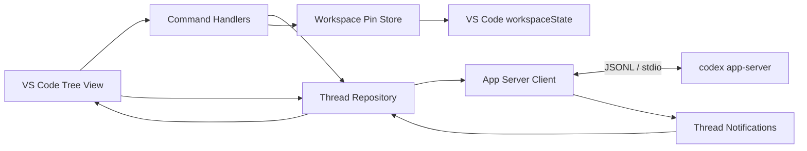

# Codex Thread Manager for VS Code 実装計画書

- 作成日: 2026-07-14
- 状態: vNext Phase D 手動受け入れ確認保留／Phase E.2 完了（Runtime settings の整合性と可視性）
- 仮称: `Codex Thread Manager`
- 調査環境: Windows / Codex CLI `0.142.3`

## 1. 目的

現在の VS Code ワークスペースに紐づく Codex スレッドを、エディターのサイドバーから整理できる拡張機能を作る。

MVP では次の操作を提供する。

1. ワークスペースのスレッド一覧表示
2. スレッドのピン留め・ピン留め解除
3. スレッド名の変更
4. スレッドのアーカイブ
5. アーカイブ済みスレッドの表示・復元

「Codex の管理」は、MVP ではスレッド管理に限定する。認証設定、モデル設定、プロンプト送信、ターンの閲覧・実行などは対象外とする。

MVP 完了後の次バージョンでは、一覧から既存スレッドを選択して会話画面を開き、そのスレッドで会話を継続できる機能を追加する。詳細は「12. 次バージョン計画（vNext）: スレッド会話画面」に分離して記載する。

## 2. 調査結果と採用方針

### 2.1 現在のワークスペース

- ディレクトリは空で、既存ソースや設定ファイルはない。
- Git リポジトリはまだ初期化されていない。
- 既存実装との互換性制約はないため、TypeScript 製の新規 VS Code 拡張として構成する。

### 2.2 Codex との接続方法

Codex の保存ファイルを直接読み書きせず、公式の `codex app-server` を使用する。

App Server は Codex の VS Code 拡張などのリッチクライアント向けインターフェースで、標準入出力では JSONL 形式の双方向メッセージを扱う。接続後は `initialize` リクエストと `initialized` 通知によるハンドシェイクが必須である。

MVP で使用するプロトコルは次のとおり。

| 機能 | App Server メソッド／保存先 | 補足 |
| --- | --- | --- |
| 一覧 | `thread/list` | `cwd`、`archived`、ページング、並び順を指定可能 |
| 詳細取得 | `thread/read` | 必要時のみ使用し、ターン本文は取得しない |
| 名前変更 | `thread/name/set` | 成功後に一覧を更新 |
| アーカイブ | `thread/archive` | 成功後にアクティブ一覧から除外 |
| 復元 | `thread/unarchive` | アーカイブ一覧の補助操作として提供 |
| ピン留め | VS Code `workspaceState` | 現行プロトコルにピン留め API がないため拡張側で管理 |

利用する主な Thread フィールドは `id`、`name`、`preview`、`cwd`、`createdAt`、`updatedAt`、`recencyAt`、`status`、`source` とする。

App Server の型は Codex CLI のバージョンに依存する。開発時にバージョンを固定した CLI から `codex app-server generate-ts` で生成した型をリポジトリへ固定し、生成元バージョンと更新用スクリプトも保存する。実行時にはレスポンスを無条件に信用せず、MVP で使う境界データを検証する。

生成元 CLI と実行時 CLI のバージョンは分離して扱う。完全一致だけを理由に接続を拒否せず、`initialize`、必要なメソッド、レスポンス境界検証が成功するかを実際の互換性判定に使う。バージョン差は Output Channel に記録し、動作可能なら警告、必須メソッドまたは境界データが非互換なら明確なエラーと更新手順を表示する。

### 2.3 「ワークスペースのスレッド」の定義

MVP では、Thread の `cwd` が VS Code のいずれかの `workspaceFolders[].uri.fsPath` と一致するスレッドを「現在のワークスペースのスレッド」と定義する。

- マルチルートワークスペースでは全ルートを `cwd` フィルターへ渡す。
- フォルダーを開いていない VS Code ウィンドウでは空状態を表示する。
- `cwd` がワークスペース配下のサブディレクトリであるスレッドまで含める機能は、App Server の `cwd` フィルターが完全一致であるため MVP 外とする。必要なら、後続版で全件走査とパス境界判定を追加する。
- 既定の対話系スレッドだけを対象とし、サブエージェントや `codex exec` の履歴を混在させない。将来、表示対象を設定で切り替えられるようにする。

### 2.4 ピン留めの意味

ピン留めは Codex 全体の状態ではなく、現在の VS Code ワークスペースに対する表示設定とする。

- 保存形式: `workspaceState` 内のスレッド ID 配列
- 表示順: ピン留め順を維持し、新しくピン留めしたものを先頭にする
- ワークスペースごとに独立して保存する
- アーカイブ時はピン留めを解除する
- 存在しないスレッド ID は完全更新時に除去する
- 他の Codex クライアントや別の VS Code ワークスペースとは同期しない

これは App Server にネイティブなピン留め機能が追加された場合に、移行可能な薄い `PinStore` として実装する。

## 3. ユーザー体験

### 3.1 画面構成

以下は MVP 完了時点の構成である。vNext Phase A.5 では、同じ View Container を Webview View へ移行している。

Activity Bar に Codex Thread Manager 用の View Container を追加し、ネイティブな Tree View を 1 つ配置する。Webview は使用しない。

Tree View のルートは次の最大 3 グループとする。

1. `ピン留め`
2. `最近のスレッド`
3. `アーカイブ`

`アーカイブ` は初期状態で折りたたみ、展開されたときに遅延取得する。アクティブ一覧は更新日時の新しい順で表示する。件数が多い場合はページ単位で取得し、`さらに表示…` 項目から続きを読み込む。

### 3.2 スレッド行

- ラベル: `name`、なければ `preview` の先頭行、どちらもなければ `無題のスレッド`
- 説明: 最終更新の相対時刻と実行状態
- アイコン: 通常、ピン留め、実行中、エラー、アーカイブを Codicon で区別
- ツールチップ: フルタイトル、`cwd`、作成／更新日時、ソース、スレッド ID
- コンテキストメニュー: ピン留め、名前変更、アーカイブの最大 3 操作

### 3.3 コマンド

| コマンド ID（予定） | 動作 |
| --- | --- |
| `codexThreadManager.refresh` | 現在の一覧を再取得 |
| `codexThreadManager.pin` | 選択スレッドをピン留め |
| `codexThreadManager.unpin` | ピン留めを解除 |
| `codexThreadManager.rename` | 入力ボックスで名前を変更 |
| `codexThreadManager.archive` | スレッドをアーカイブ |
| `codexThreadManager.unarchive` | アーカイブ済みスレッドを復元 |

名前変更では現在名を初期値にし、前後の空白を除いた空文字を拒否する。アーカイブは復元可能なので確認ダイアログを挟まず、成功通知に `元に戻す` アクションを付ける。

### 3.4 空状態とエラー表示

次の状態は Tree View の Welcome/Message と通知で明確に案内する。

- ワークスペースフォルダーがない
- 対象スレッドがない
- `codex` コマンドが見つからない
- Codex CLI が App Server に対応していない
- App Server の起動・初期化に失敗した
- 接続が終了した、タイムアウトした
- 名前変更・アーカイブなど個別操作が失敗した

エラー通知には、設定を開く、再接続、再読み込みなど、その場で可能な次の操作を付ける。詳細は専用 Output Channel に記録するが、スレッド本文や認証情報はログへ出さない。

## 4. アーキテクチャ



### 4.1 モジュール案

```text
src/
  extension.ts
  codex/
    appServerClient.ts
    jsonlTransport.ts
    threadRepository.ts
    protocol/
      generated/
      guards.ts
  commands/
    registerCommands.ts
    threadCommands.ts
  state/
    pinStore.ts
  views/
    threadTreeItem.ts
    threadTreeProvider.ts
  common/
    errors.ts
    disposable.ts
scripts/
  generate-protocol.mjs
test/
  unit/
  integration/
    fake-app-server/
  vscode/
```

### 4.2 App Server Client

- Node.js の `child_process.spawn` で `codex app-server --listen stdio://` を起動する。
- シェルを介さず、実行ファイルと引数を分離して渡す。
- 接続は拡張プロセス内で 1 本だけ保持し、必要になるまで遅延起動する。
- 連番リクエスト ID と `Map` で応答を対応付ける。
- リクエストごとにタイムアウトとキャンセルを扱う。
- stdout は行単位に JSON として解析し、stderr は診断ログとして扱う。
- `thread/name/updated`、`thread/archived`、`thread/unarchived`、`thread/status/changed` を受けて該当項目を更新する。
- 型生成元の CLI バージョンと実行時に解決した CLI のバージョンを診断情報として保持する。
- CLI のバージョン文字列だけで互換性を断定せず、ハンドシェイク、必須メソッド、境界検証の結果を優先する。
- 次バージョンの会話機能で必要になる Server Request を追加できるよう、request/response/notification の振り分けを拡張可能な構造にする。MVP で未対応の Server Request を受けた場合は、安全なエラーを返して保留し続けない。
- プロセス終了時は保留中リクエストをすべて失敗させ、UI を再接続可能な状態へ戻す。
- `deactivate` でストリーム、イベント購読、子プロセスを確実に破棄する。

### 4.3 Thread Repository

App Server のプロトコル型を View から隠し、次を担当する。

- アクティブ／アーカイブ一覧のページング
- ワークスペース `cwd` フィルター
- Thread から表示モデルへの変換
- 同時更新の世代管理と古いレスポンスの破棄
- 同じスレッドへの重複操作の抑止
- コマンド成功後とサーバー通知後のキャッシュ更新
- ピン留め情報との結合と並び替え

### 4.4 VS Code 拡張としての実行場所

`extensionKind: ["workspace"]` とし、Remote SSH、Dev Container、WSL ではワークスペース側で実行する。これにより `cwd` と Codex CLI の実行環境を一致させる。

- リモート環境では、その環境内に Codex CLI が必要
- VS Code for the Web は子プロセスを起動できないため MVP 非対応
- Virtual Workspace は MVP 非対応
- Workspace Trust がない状態では起動を制限し、信頼後の再読み込みを案内

## 5. 設定項目

MVP で公開する設定は最小限にする。

| 設定 | 既定値 | 用途 |
| --- | --- | --- |
| `codexThreadManager.codexPath` | `codex` | 自動解決できない場合に Codex CLI の実行ファイルまたは公式 npm shim を指定 |
| `codexThreadManager.pageSize` | `50` | 一覧 1 回あたりの取得件数 |

開発用または診断用の内部設定を一般ユーザー向け設定に混ぜない。CLI の最小対応バージョンは、実装時の互換テストで確定し、`README.md` と起動時診断に明記する。

## 6. セキュリティとデータ取り扱い

- `~/.codex` 配下の DB、JSONL、認証ファイルを直接操作しない。
- OpenAI API キーを拡張側で要求・保存しない。既存の Codex 認証状態を利用する。
- `codexPath` はシェル文字列へ連結せず、実行ファイルとして起動する。
- App Server は stdio のローカル子プロセスとしてのみ起動し、WebSocket ポートを公開しない。
- Output Channel にスレッド本文、入力内容、トークン、環境変数を記録しない。
- アーカイブは可逆操作として実装し、削除機能は提供しない。
- App Server のうち必要なメソッドだけをラップし、任意メソッド実行機能は UI や設定から公開しない。

## 7. 実装フェーズ

### Phase 1: プロジェクト基盤

- npm / TypeScript ベースの VS Code 拡張を作成
- `package.json` の View、Command、Menu、Configuration を定義
- esbuild による拡張バンドル、ESLint、型チェックを設定
- Extension Development Host 用の launch/task 設定を追加
- README、CHANGELOG、LICENSE、`.gitignore` の初期版を追加

完了条件: 空の Tree View を持つ拡張が Extension Development Host で起動する。

### Phase 2: App Server 接続

- 現行 CLI から TypeScript プロトコル型を生成し、更新スクリプトを追加
- JSONL transport と request/response/notification 処理を実装
- initialize ハンドシェイク、タイムアウト、終了処理、Output Channel を実装
- `codexPath` と互換性エラーを診断できるようにする

完了条件: 実ユーザーデータを変更せず、`thread/list` の応答を取得できる。

### Phase 2.1: CLI 解決と互換性診断の強化

Phase 2 の実機確認で、通常の PowerShell と VS Code Extension Host では `PATH` とコマンド解決結果が異なり、PowerShell の npm shim は見つかってもシェルを介さない `spawn` では起動できないケースを確認した。Phase 3 の前に次を実施する。

- 実行ファイルと先行引数を表す `CodexCommand` と、それを生成する `CodexExecutableResolver` を追加する。
- 解決順序を、明示的な `codexPath`、`PATH` 上のネイティブ実行ファイル、公式 npm shim の順に定義する。
- Windows の公式 npm shim はシェルで実行せず、隣接する npm package manifest の `bin` エントリを解決して `node` と引数を分離して起動する。
- 他の VS Code 拡張のバージョン付きインストールパスや内部ファイルを探索・固定参照しない。
- 解決した CLI のパス、`codex --version`、型生成元バージョンを Output Channel の診断へ記録する。ホームディレクトリなど不要なパス情報は UI 通知へ出さない。
- 生成元と実行時のバージョンが異なる場合は警告するが、それだけでは拒否しない。`initialize`、`thread/list`、レスポンス境界検証の成功を互換性の基準にする。
- 必須メソッド未対応またはレスポンス非互換時は、検出したバージョン、生成元バージョン、設定を開く／再試行する操作を案内する。
- 型生成に使う開発用 CLI のバージョンを再現可能な形で固定し、更新時は生成差分と互換性テストを同じ変更に含める。

完了条件: Windows の公式 npm インストールを含む標準的な CLI 配置を既定設定で安全に解決でき、生成元と異なる互換 CLI でも `thread/list` が成功し、非互換 CLI では理由と対処が表示される。

実装結果（2026-07-15）:

- ネイティブ実行ファイルを優先し、Windows の公式 npm shim をmanifest検証後に `node` と先行引数へ分解するresolverを追加した。
- 型生成CLIをexactな開発依存 `@openai/codex@0.144.2` に固定し、生成元バージョン定数もスナップショットと同時生成するようにした。
- 実行時 `0.142.3`／生成元 `0.144.2` の公式npm CLIで、実データを変更しない `initialize` と `thread/list(limit: 1)` の成功を確認した。
- 必須メソッド未対応と不正な境界レスポンスを統合テストし、両バージョンと設定／再試行の対処を返すことを確認した。

### Phase 3: 読み取り専用の一覧

- Thread Repository と TreeDataProvider を実装
- 単一／マルチルート `cwd` フィルターを実装
- ピン留め・最近・アーカイブのグループを追加
- ページング、手動更新、空状態、状態アイコン、ツールチップを実装
- ワークスペースフォルダー変更時に一覧を再取得

完了条件: 現在のワークスペースのアクティブ／アーカイブ済みスレッドだけを表示できる。

実装結果（2026-07-16）:

- Thread Repository を追加し、App Server の `thread/list` から取得した Thread を Tree View 用の表示モデルへ変換するようにした。
- 単一／マルチルートの `cwd` フィルターを維持したまま、アクティブとアーカイブの初回ページおよび追加ページを読み取れるようにした。
- Tree View に実スレッド行、状態アイコン、相対更新時刻、ツールチップ、`Load more…` 項目、空状態を表示するようにした。
- ワークスペースフォルダーや設定変更時にリポジトリのスナップショットを更新し、古いレスポンスを世代で破棄する既存制御へ統合した。

### Phase 4: ピン留め

- `PinStore` を `workspaceState` 上に実装
- ピン留め／解除コマンドとコンテキスト表示条件を追加
- 再読み込み後の順序復元、無効 ID の掃除を実装

完了条件: ピン留め状態が同じワークスペースで永続化され、別ワークスペースに漏れない。

実装結果（2026-07-16）:

- `PinStore` を追加し、`workspaceState` にピン留め ID を新規ピン優先の順序で保存するようにした。
- ピン留め済みスレッドを専用グループへ昇格し、最近のスレッドからは重複表示しないようにした。
- アクティブスレッドのコンテキストメニューにピン留め／解除を追加し、アーカイブ済みスレッドには表示しないようにした。
- 全ページ読み込み済みの更新時に、存在しないピン留め ID を掃除するようにした。

### Phase 5: 名前変更とアーカイブ

- 名前変更入力、検証、`thread/name/set` 呼び出しを実装
- `thread/archive`、成功通知、Undo を実装
- アーカイブ一覧からの `thread/unarchive` を実装
- 操作中の二重実行防止と失敗時の UI 復元を実装
- App Server 通知による差分更新を実装

完了条件: 操作結果が Codex 側に保存され、再取得後も一致する。

実装結果（2026-07-16）:

- 名前変更コマンドを実装し、空白除去後の空文字を拒否して `thread/name/set` へ保存するようにした。
- アーカイブコマンドを実装し、成功通知から `Undo` で `thread/unarchive` を呼び出せるようにした。
- アーカイブ一覧の復元コマンドを `thread/unarchive` に接続し、一覧キャッシュへ即時反映するようにした。
- スレッド単位の操作中フラグで重複実行を防ぎ、失敗時は App Server 側の変更前キャッシュを維持してエラーを表示するようにした。
- `thread/name/updated`、`thread/archived`、`thread/unarchived`、`thread/status/changed` 通知を受けて Tree View を更新するようにした。

### Phase 6: 品質保証と配布準備

- 単体、統合、Extension Host テストを追加
- Windows、macOS、Linux、および WSL/Remote の代表環境を確認
- VSIX を生成し、クリーン環境へのインストールを確認
- 利用条件、制約、トラブルシュートを README に記載
- 公開する場合は Marketplace 用メタデータ、アイコン、publisher を確定

完了条件: 後述の受け入れ条件を満たし、VSIX から再現可能に動作する。

実装結果（2026-07-16）:

- JSONL transport、境界検証、CLI resolver、PinStore、Thread Repository、Tree View の単体テストを追加した。
- 偽 App Server による rename/archive/unarchive、通知、タイムアウト、切断、stderr の秘匿化、未対応 Server Request の統合テストを追加した。
- VS Code `1.92.2` を使った Extension Host テストを追加し、View、Command、Menu、Configuration の登録を確認するようにした。
- Windows の Extension Host でテストを実行し、GitHub Actions では Windows、macOS、Linux の品質検証、VSIX 生成、Extension Host テストを行うマトリクスを追加した。
- VSIX の非公開インストール手順、要件、制約、Remote/WSL の注意点、トラブルシュート、手動受け入れチェックリストを文書化した。
- `thread/name/updated` の生成型フィールドとの不一致と、`thread/status/changed` が表示モデルへ反映されない不具合を修正した。
- `esbuild` と `@vscode/vsce` を監査済みの修正版へ更新し、`npm audit` 0 件を確認した。
- Marketplace 公開は予定していないため、公開用 publisher、掲載文、公開操作の整備は省略した。

## 8. テスト計画

### 8.1 単体テスト

- JSONL の分割受信、複数行、壊れた JSON、空行
- initialize 前の送信抑止と正常なハンドシェイク
- リクエスト ID の対応、タイムアウト、プロセス終了、キャンセル
- `thread/list` のページングとアクティブ／アーカイブ分離
- Thread のラベルフォールバックと日時・状態表示
- ピン順序、永続化、解除、無効 ID の除去
- Windows の大文字小文字、区切り文字を含むワークスペースパス
- 同時 refresh で古いレスポンスが UI を上書きしないこと

### 8.2 統合テスト

実ユーザーの Codex データを変更しないよう、偽 App Server プロセスを用意する。

- initialize、list、rename、archive、unarchive の正常系
- サーバー通知による UI 更新
- メソッド未対応、エラー応答、stderr 出力、突然の終了
- 応答遅延と順序入れ替わり
- 空、複数ページ、大量件数

実 Codex CLI を使うスモークテストは opt-in とし、一時的な `CODEX_HOME` を使って一覧取得と接続終了だけを確認する。

### 8.3 VS Code Extension Host テスト

- View とコマンドが登録される
- contextValue に応じて正しいメニューだけが表示される
- `workspaceState` がウィンドウ再読み込み後も復元される
- ワークスペースフォルダー追加・削除で再読込される
- Codex CLI 不在時に案内が表示される
- CLI 解決がネイティブ実行ファイル、空白を含む明示パス、Windows の公式 npm shim で成功する
- PowerShell と Extension Host の `PATH` が異なる場合でも、診断に実際の解決結果が表示される
- 型生成元と実行時の CLI バージョンが異なっても、必須プロトコルが互換なら接続を継続する
- 必須メソッドまたは境界データが非互換なら、安全に停止して両方のバージョンと対処を表示する

## 9. 受け入れ条件

- [x] 現在の VS Code ワークスペースに完全一致する Codex スレッドだけが表示される
- [x] 名前がないスレッドもプレビューまたは代替名で識別できる
- [x] ピン留めしたスレッドが先頭グループへ移動し、ウィンドウ再読み込み後も維持される
- [x] スレッド名の変更が Codex 側へ保存され、一覧へ反映される
- [x] アーカイブしたスレッドがアクティブ一覧から消え、アーカイブ一覧へ移動する
- [x] アーカイブ直後に Undo でき、アーカイブ一覧からも復元できる
- [x] 失敗時にデータを失わず、原因と次の操作がユーザーに示される
- [x] `~/.codex` の内部ファイルを直接変更しない
- [x] 拡張終了時に App Server プロセスと全 Disposable が残らない
- [x] 公式 Codex VS Code 拡張のバージョン付き内部パスへ依存せず、標準的な CLI 配置を解決できる
- [x] 型生成元と実行時の CLI バージョン、および互換性判定結果を診断できる
- [x] CLI バージョンが完全一致しなくても、必須プロトコルが互換なら利用できる
- [x] 単体テスト、統合テスト、型チェック、lint、bundle、VSIX 作成が成功する

## 10. 主なリスクと対策

| リスク | 影響 | 対策 |
| --- | --- | --- |
| App Server が CLI 上で experimental 扱い | CLI 更新で型やメソッドが変わる | 再現可能な型スナップショット、生成元／実行時バージョン表示、境界検証、実メソッドによる互換性テスト |
| シェルと Extension Host で CLI の解決結果が異なる | 開発環境では動くのに拡張から起動できない | `CodexExecutableResolver`、npm shim の非シェル解決、実際の解決結果を診断表示 |
| 公式 VS Code 拡張の内部 CLI を直接参照する | 公式拡張の更新でバージョン付きパスが変わり起動不能になる | 他拡張の内部パスへ依存せず、独立した CLI インストールと `codexPath` を利用 |
| ピン留めが Codex ネイティブ状態ではない | 他クライアントと同期されない | UI と README に「ワークスペースローカル」と明記し、`PinStore` を交換可能にする |
| `cwd` が完全一致のみ | サブディレクトリで開始したスレッドが出ない | MVP の定義を明記し、後続版で配下判定モードを検討 |
| CLI が PATH にない | App Server を起動できない | `codexPath` 設定、起動時診断、設定を開くアクション |
| リモート環境に CLI がない | Remote で動作しない | workspace extension として実行し、リモート側インストールを案内 |
| 大量のスレッド | 初期表示や更新が遅い | ページング、アーカイブ遅延取得、更新キャンセル、キャッシュ |
| 外部クライアントからの変更 | 表示が一時的に古くなる | App Server 通知、View 再表示時更新、手動 refresh |
| 企業環境で未知の clientInfo | 監査ログ上の識別に課題 | 一意な clientInfo を設定し、一般公開・企業利用前に OpenAI の既知クライアント登録要件を確認 |

## 11. MVP で行わないこと

- 新規スレッド作成
- スレッドを開いて会話する機能（次バージョンで実装予定）
- ターン、メッセージ、diff、ツール実行履歴の表示（次バージョンで段階的に実装予定）
- スレッド削除、複数選択、一括アーカイブ
- Codex 認証、モデル、sandbox、MCP、plugin の設定管理
- クラウド専用／ChatGPT 側だけに存在するチャットの管理
- Codex 公式 VS Code 拡張の非公開 API や内部ファイルへの依存
- ピン留めの端末間・クライアント間同期
- VS Code for the Web / Virtual Workspace 対応
- ワークスペース配下の任意サブディレクトリを `cwd` とするスレッドの包含

## 12. 次バージョン計画（vNext）: スレッド会話画面

このセクションは MVP の実装・受け入れ条件には含めない。MVP のスレッド管理機能が安定し、App Server Client の互換テストが通った後に着手する独立した次バージョンの計画とする。

### 12.1 目的とユーザーフロー

既存スレッドの整理から、そのスレッドでの作業再開までを VS Code 内で完結させる。

1. Codex サイドバーのスレッド行を選択する
2. 同じ Webview View 内で一覧から対象スレッドの会話画面へ切り替える
3. 過去のユーザーメッセージ、Codex の応答、主な作業イベントを時系列で表示する
4. 画面下部の入力欄からテキストメッセージを送信する
5. Codex の応答と作業状況をストリーミング表示する
6. 必要な承認や追加質問へ会話画面内で回答する
7. 実行中のターンを停止できる
8. 「戻る」で読み込み済み一覧と選択位置へ復帰する

### 12.2 vNext の対象範囲

vNext の最初のリリースでは、既存スレッドに対するテキスト会話を完成させる。

- 既存スレッドの履歴表示
- 既存スレッドの resume
- テキストメッセージ送信
- Codex メッセージの差分ストリーミング
- ターンの開始、完了、失敗、停止状態の表示
- コマンド実行、ファイル変更、MCP／ツール呼び出しの要約カード
- コマンド実行、ファイル変更、追加権限などの承認・拒否
- Codex からの追加質問への回答
- 実行中ターンの interrupt
- App Server 再接続後の履歴再同期
- VS Code ウィンドウ再読み込み後の会話画面復元
- ユーザー／Codex の発言本文の Markdown レンダリング
- 発言者名を表示しない、本文中心の会話レイアウト
- 会話画面からのモデル、推論レベル、速度、権限の変更
- 公式 Codex 拡張と同様に入力欄の補助操作を開く「追加」ボタン

次の機能は vNext 初版には含めず、会話画面が安定してから検討する。

- 新規スレッド作成
- 画像、ファイル、Skill、mention の入力
- 音声／Realtime 会話
- 完全なターミナルエミュレーター
- 複雑な diff レビュー UI
- サブエージェント専用ナビゲーション
- 複数ターンの同時送信

### 12.3 App Server プロトコル

| 用途 | メソッド／通知 | vNext での扱い |
| --- | --- | --- |
| 履歴取得 | `thread/read` (`includeTurns: true`) | 会話画面の初期表示と再同期に使用 |
| 作業再開 | `thread/resume` | メッセージ送信前に対象スレッドへ再接続 |
| メッセージ送信 | `turn/start` | `threadId` と text input を送信 |
| 実行中の追加入力 | `turn/steer` | 基本送受信の安定後に有効化 |
| ターン停止 | `turn/interrupt` | Stop 操作から `threadId` と `turnId` を送信 |
| メッセージ差分 | `item/agentMessage/delta` | 対象メッセージへ差分を連結 |
| 項目ライフサイクル | `item/started` / `item/completed` | メッセージと作業カードの状態更新 |
| ターンライフサイクル | `turn/started` / `turn/completed` | 入力欄、Stop、エラー表示を更新 |
| 状態変化 | `thread/status/changed` | 他画面や再接続を含む状態同期 |
| 作業進捗 | command/file change/MCP/plan 系通知 | 折りたたみ可能な作業カードへ反映 |
| 承認 | `item/commandExecution/requestApproval`、`item/fileChange/requestApproval`、`item/permissions/requestApproval` | 明示的な承認／拒否 UI を表示して同じ request ID へ応答 |
| 追加質問 | `item/tool/requestUserInput`、`mcpServer/elicitation/request` | 質問形式に応じた入力 UI を表示して応答 |

App Server の Server Request は通知と異なり、クライアントから同じ request ID への応答が必要である。未対応の要求を無視するとターンが停止したままになるため、対応可否を判定し、未対応時は安全に拒否して理由を表示する。実験的 API が必要な要求は、対応 CLI バージョンと capability を確認してから個別に有効化する。

### 12.4 会話画面の設計

通常導線の会話画面は、スレッド一覧と同じ `WebviewView` 内に表示する。App Server への接続、履歴、承認判断は Extension Host が所有し、Webview は表示とユーザー入力だけを担当する。Phase A で作成した `WebviewPanel` と共通 renderer は、明示的なエディター表示や互換用途へ再利用できる構成を維持する。

追加する主なモジュールは次のとおり。

```text
src/
  conversation/
    conversationPanelManager.ts
    conversationSession.ts
    conversationReducer.ts
    conversationViewModel.ts
    approvalController.ts
  webview/
    conversation/
      main.ts
      styles.css
      protocol.ts
```

- `ConversationPanelManager`: thread ID ごとに 1 つのパネルを生成・再利用・復元
- `ConversationSession`: `thread/read`、`thread/resume`、turn 操作、再接続を調整
- `ConversationReducer`: 履歴とストリーミング通知を決定的に ViewModel へ反映
- `ApprovalController`: Server Request の保留、表示、応答、破棄を一元管理
- Webview: メッセージ一覧、composer、Stop、承認／質問 UI、作業カードを描画

Webview と Extension Host の通信は専用の discriminated union で型付けする。Webview から任意の App Server メソッド名やシェルコマンドを渡せる設計にはしない。

表示上の方針は次のとおり。

- ユーザー／Codex メッセージは配置、背景、余白などで区別し、`Codex`、`You` などの発言者名は表示しない
- 応答中は同じメッセージへ差分を追記し、完了後に確定する
- コマンド、ファイル変更、ツール呼び出しは既定で要約し、詳細を展開可能にする
- 長い履歴は段階的に描画し、スクロール位置を維持する
- 新着追従はユーザーが最下部付近にいる場合だけ行う
- 発言本文は Markdown として HTML レンダリングし、見出し、リスト、リンク、引用、インラインコード、コードブロックを VS Code テーマに合わせて表示する
- Markdown から生成した HTML は許可リストでサニタイズし、生 HTML、危険な URL、イベント属性、スクリプトを実行させない
- Webview に nonce 付き Content Security Policy と限定した `localResourceRoots` を設定する
- 承認要求は対象コマンド、パス、理由、権限変更の範囲を表示し、承認を既定選択にしない
- 承認待ちで会話画面から離れる場合は確認し、自動承認は絶対に行わない

### 12.5 vNext 実装フェーズ

#### vNext Phase A: 読み取り専用会話画面

- スレッド行の選択と `openThread` コマンドを追加
- thread ID ごとの WebviewPanel 管理を実装
- `thread/read(includeTurns: true)` から履歴 ViewModel を生成
- ユーザー／Codex メッセージ、ターン状態、基本作業カードを表示
- パネルの再利用、復元、再読み込みを実装

完了条件: 一覧で選択した正しいスレッドの履歴が、書き込みなしで会話タブに表示される。

実装結果（2026-07-16）:

- Tree View のスレッド行へ `openThread` コマンドを接続し、選択した thread ID の会話タブを開くようにした。
- thread ID ごとに WebviewPanel を 1 枚だけ管理し、再選択時のタブ再利用、ウィンドウ再読み込み後の復元、手動の履歴再読み込みを実装した。
- `thread/read(includeTurns: true)` のレスポンス境界を検証し、要求した thread ID と異なる履歴や壊れた turn/item を拒否するようにした。
- App Server の生成型を Webview へ直接渡さず、ユーザー／Codex メッセージ、ターン状態、要約した作業カードだけを持つ専用 ViewModel へ変換した。
- reasoning 本文、コマンドの生出力、ファイル diff、ツール引数／結果、サブエージェント prompt、hook 断片は Webview へ転送しないようにした。
- nonce 付き CSP、限定した `localResourceRoots`、型付きメッセージ、`textContent` ベースの描画を採用し、任意コマンドや未定義メッセージを受け付けないようにした。
- 履歴変換、未知 item、機密ペイロード除外、パネル再利用／復元、古い非同期結果の破棄、CSP、偽 App Server の `thread/read` を自動テストへ追加した。
- 実行時 CLI `0.142.3` に対して、本文をログへ出さない読み取り専用スモークテストで `thread/list` と `thread/read(includeTurns: true)` の境界互換性を確認した。

#### vNext Phase A.5: スレッド一覧の Webview View 化

Phase A で整備した Webview のビルド、CSP、テーマ、型付きメッセージ、テスト基盤を再利用し、サイドバーのネイティブ Tree View を Webview View へ置き換える。App Server Client、Thread Repository、PinStore、操作中制御は Extension Host に残し、表示層だけを差し替える。

- `WebviewViewProvider` を追加し、ピン留め、最近、アーカイブのグループ構成を維持する
- スレッド行を最小 40〜48px 程度のカード風レイアウトとし、現状の約 1.5〜2 倍の縦幅を確保する
- タイトル、相対更新時刻、状態、ピン留め、アーカイブを VS Code のテーマトークンで表示する
- refresh、設定、ページング、ピン留め、名前変更、アーカイブ、復元を型付き Webview メッセージから既存コマンドへ接続する
- スレッド選択は同じ Webview View 内の `conversation(threadId)` へ遷移し、Phase A の履歴 ViewModel と renderer を再利用する
- キーボード移動、フォーカス表示、ARIA、スクリーンリーダー、狭いサイドバーでの省略表示を実装する
- 未定義メッセージや任意コマンドを拒否し、Webview から App Server メソッドを直接指定できないようにする
- Tree View からの移行後も workspaceState、通知更新、ページカーソル、操作失敗時の復元を回帰テストする

完了条件: 公式 Codex 拡張に近い余白を持つスレッド一覧と読み取り専用会話を同じサイドバー内で切り替え、MVP の管理操作をキーボードとマウスの両方から利用できる。

実装結果（2026-07-17）:

- 単一 Webview View 内に `list` / `conversation(threadId)` の画面状態を実装し、通常選択でエディタータブを増やさない導線へ変更した。
- 会話画面に Back と Reload を追加し、一覧の読み込み済み snapshot、スクロール位置、選択スレッドを可能な範囲で復元するようにした。
- Phase A の履歴 ViewModel と `textContent` ベースの renderer を共通化し、CSP と限定した `localResourceRoots` を維持した。
- refresh、設定、ページング、ピン留め、名前変更、アーカイブ、復元を固定 allowlist の型付きメッセージへ接続した。
- 48px のカード、インライン管理アイコン、矢印／Home／End 移動、フォーカス表示、ARIA ラベルを追加した。
- 画面遷移中の古い `thread/read`、存在しなくなった行、冷起動時の復元待ちを安全に処理するようにした。
- Webview View の遷移、復元、競合、操作境界を自動テストし、必要な Webview 資産が VSIX に入ることを検証するスクリプトを追加した。

#### vNext Phase A.6: スレッド一覧 UI の整理

Phase B の入力・ストリーミング UI を追加する前に、一覧画面の重複操作とグループ表示を整理する。

- View タイトルと Webview 内で重複しているタイトル、refresh、設定をネイティブ View タイトル側へ集約する
- ピン留め、最近、アーカイブの各グループをキーボード操作可能な折りたたみ表示にする
- 初期状態はピン留めと最近を展開、アーカイブを折りたたみとする
- 一覧と会話の往復、および VS Code のウィンドウ再読み込み後も折りたたみ状態を復元する
- 折りたたまれたグループ内の行を矢印キーナビゲーションの対象から除外する
- 行ごとの管理メニューをインラインアイコンへ置き換え、複数メニューが同時に開く状態をなくす
- 管理アイコンの領域を除くカード全体から会話を開けるようにする

完了条件: 一覧内に重複したタイトルや操作がなく、各グループの折りたたみ状態が維持され、カード本文と管理アイコンを誤操作なく使い分けられる。

実装結果（2026-07-17）:

- Webview 内の `Codex threads`、Refresh、Settings を削除し、常に利用できるネイティブ View タイトルのアイコン操作へ集約した。
- `details` / `summary` を使って各グループを折りたたみ可能にし、マウス、Tab、Enter、Space で操作できるようにした。
- 保存状態を version 2 へ更新し、グループの展開状態を一覧・会話間の遷移とウィンドウ再読み込み後に復元するようにした。
- version 1 の保存状態を既定の展開状態へ移行し、既存の会話・スクロール復元を維持した。
- 矢印／Home／End 移動は展開中のグループにある行だけを対象とするようにした。
- 通知による一覧再描画でも、操作中のグループ見出しへキーボードフォーカスを復元するようにした。
- ellipsis メニューを廃止し、hover、キーボードフォーカス、タッチ環境で利用できる Pin／Rename／Archive／Restore アイコンへ置き換えた。
- タイトル、説明、余白を含むカード本文を単一の会話オープンボタンとし、独立したアイコン操作領域から会話画面へ誤遷移しない構造にした。
- Pin、Archive、Restore で行が別グループへ移動しても、対応アイコン、会話オープンボタン、または移動先グループ見出しへフォーカスを復元するようにした。

#### vNext Phase B: テキスト会話とストリーミング

- `thread/resume` と `turn/start` を実装
- composer の送信、送信中状態、二重送信防止を実装
- メッセージ、item、turn 通知を reducer へ接続
- `turn/interrupt` と Stop UI を実装
- 失敗、接続断、再接続後の履歴再同期を実装

完了条件: 既存スレッドへメッセージを送り、Codex の応答をリアルタイム表示し、必要なら停止できる。

実装結果（2026-07-18）:

- `thread/resume`、`turn/start`、`turn/interrupt` を App Server Client へ追加し、生成型に沿ったレスポンス境界検証を実装した。
- サイドバー会話画面へテキスト composer、Ctrl/Cmd+Enter 送信、送信中表示、二重送信防止、実行中だけ有効な Stop を追加した。
- Extension Host が所有する `ConversationSession` と ID ベースの reducer を追加し、turn/item の開始・完了と agent message delta を別スレッドへ混入させず反映するようにした。
- delta には sequence がないためライブ中の同一 chunk を推測で除去せず、`item/completed`、`turn/completed`、または再同期した履歴を正として最終表示を収束させるようにした。
- transcript を turn/item ID で差分更新し、ストリーミング中も展開中の作業カード、キーボードフォーカス、ユーザーが離れたスクロール位置を維持するようにした。
- Webview からは固定された Send/Stop メッセージだけを受け付け、Stop 対象の turn ID は Extension Host が保持する値に限定した。入力本文は Output Channel へ記録しない。
- 接続断では確定済み履歴を残して入力を無効化し、Reload または再接続後に `thread/resume` と `thread/read(includeTurns: true)` で履歴を再同期するようにした。
- resume、送信、delta、完了、Stop、不正レスポンス、通知順序、別スレッド隔離、再同期、ログ秘匿を単体テストと偽 App Server 統合テストへ追加した。

#### vNext Phase B.1: 会話表示と実行設定

- 履歴とストリーミング中の発言本文を Markdown からサニタイズ済み HTML へ変換し、コードブロックを含めて描画する
- 発言者名のラベルを削除し、名前がなくてもユーザー／Codex を識別できるレイアウトとアクセシブルな読み上げ情報を実装する
- composer 周辺に、モデル、推論レベル、速度、権限を確認・変更できる実行設定 UI を追加する
- 設定値は App Server が公開するモデル一覧、capability、設定スキーマを基準に検証し、未対応の値を推測で送信しない
- 設定変更は次に開始するターンから適用し、進行中ターンの条件は途中で変更しない。現在値、適用タイミング、非対応状態を UI に明示する
- 権限設定は sandbox と承認ポリシーの意味・影響範囲を表示し、権限拡大を暗黙に選択または永続化しない
- 公式 Codex 拡張に合わせて composer に「追加」ボタンを設け、キーボード操作可能な補助操作／コンテキスト追加メニューを開く
- 「追加」メニューは利用可能な機能だけを表示し、画像、ファイル、Skill、mention など未実装の入力は対応フェーズで段階的に有効化する

完了条件: 発言者名を出さずに Markdown が安全かつ読みやすく表示され、会話画面から次ターンのモデル、推論レベル、速度、権限を変更でき、「追加」ボタンから利用可能な補助操作へアクセスできる。

実装結果（2026-07-18）:

- 履歴とストリーミング中の発言を共通の Markdown DOM renderer へ接続し、見出し、リスト、引用、コード、強調、安全なリンクを VS Code テーマで表示するようにした。生 HTML と危険な URL は DOM として解釈しない。
- 画面上の `You`／`Codex` ラベルを削除し、配置と背景で発言を区別した。スクリーンリーダー向けの役割説明は維持した。
- `model/list` と `thread/resume` から現在のモデル、推論レベル、service tier、sandbox、承認ポリシーを読み込み、composer の実行設定から変更できるようにした。
- 設定候補と Webview メッセージを Extension Host 側で再検証し、選択値を次の `thread/resume`／`turn/start` だけへ適用するようにした。実行中ターンは変更せず、権限拡大も自動選択しない。
- composer に「追加」ボタンとキーボード操作可能なメニューを追加した。現時点で利用可能な追加入力がない場合は空状態を表示し、未実装のファイル、画像、Skill、mention を実行項目として公開しない。
- runtime 設定の境界検証、未許可値の拒否、次ターンへの設定反映を自動テストへ追加した。

#### vNext Phase C: 承認・質問・作業イベント

- command/file change/permission の承認要求を表示・応答
- 追加質問と MCP elicitation の入力・応答
- コマンド、ファイル変更、MCP、plan の作業カードを実装
- 未対応 Server Request の安全な拒否と診断を実装
- 必要な範囲だけ experimental capability を互換テスト付きで有効化

完了条件: 承認や追加回答が必要な Codex ターンを、別クライアントへ移動せず完了できる。

実装結果（2026-07-18）:

- App Server Client に対応 Server Request の保留と一度限りの応答を追加し、command、file change、permissions、request_user_input、MCP elicitation だけを明示的に受け付けるようにした。未知の要求は従来どおり安全に拒否する。
- 会話画面へ承認カードを追加し、コマンド、作業ディレクトリ、ネットワーク対象、変更ルート、要求権限、理由を表示して、1 回だけの承認、セッション承認、拒否、キャンセルを選べるようにした。承認を既定選択にはしていない。
- request_user_input の選択肢、自由入力、secret 入力を型付き Webview メッセージで応答できるようにした。質問 ID と全回答は Extension Host 側で再検証する。
- MCP の標準 form elicitation は string、number、boolean、単一選択 enum の入力に対応した。未対応の openai/form、複数選択 enum、URL mode は内容を実行せず、拒否またはキャンセルだけを選べるようにした。
- 保留要求は thread ID ごとに分離し、別スレッドの画面から応答できないようにした。切断時は応答不能になった要求を破棄し、serverRequest/resolved 通知でも UI から除去する。
- command、file change、MCP、plan は既存の安全な作業カードへ統合し、生のコマンド出力、diff、ツール引数・結果を Webview へ転送しない方針を維持した。
- Server Request の転送と二重応答防止、承認・質問・MCP の境界検証、Webview の応答 allowlist を自動テストへ追加した。

#### vNext Phase D: 品質保証

- 大量履歴、長時間ストリーミング、複数スレッド切り替えを負荷テスト
- Webview メッセージ境界、Markdown、CSP のセキュリティテスト
- キーボード操作、スクリーンリーダー、コントラストを確認
- Windows、macOS、Linux、Remote/WSL で会話を確認
- CLI 更新に対するプロトコル互換テストを追加

完了条件: vNext の受け入れ条件を満たし、MVP の管理機能に回帰がない。

自動化結果（2026-07-18）:

- 1,000 turn／2,000 item の保存履歴と、5,000 delta の長時間ストリーミングを模した負荷回帰テストを追加した。完了スナップショットへの収束と、5,000件の別スレッド通知が混入しないことも同時に検証する。
- 最小 DOM 上で Markdown renderer を実行し、HTML 風入力とコードを常にテキストとして扱い、`javascript:`、`data:`、相対 URL からリンク要素を生成しないセキュリティテストを追加した。
- 固定した `@openai/codex` から App Server TypeScript 型を一時ディレクトリへ再生成し、チェックイン済みの全生成ファイルと CLI バージョンの差分を `npm run verify` で拒否するようにした。
- Windows の High Contrast を含む forced-colors 環境で、カード、メニュー、入力欄、フォーカス境界をシステム色で明示するようにした。
- Windows、macOS、Linux の CI／Extension Host 検証は継続し、スクリーンリーダー、長時間 UI、WSL、Remote SSH、Dev Container は `docs/TESTING.md` の記録表を埋めるまで Phase D 完了としない。

### 12.6 vNext テスト計画

- 履歴の turn/item を正しい順序と種類へ変換できる
- delta の重複、欠落、順序入れ替わりで表示が破損しない
- 複数スレッドの通知が別の会話画面へ混入しない
- 実行中は通常送信を二重に開始せず、Stop が正しい turn ID を使う
- 接続断後に `thread/read` で確定状態へ再同期できる
- 承認の approve/reject/cancel が元の request ID に一度だけ応答する
- 承認待ちの会話画面から離れても暗黙の承認が発生しない
- 追加質問の選択肢、自由入力、タイムアウトを扱える
- Webview から未定義メッセージや任意コマンドを実行できない
- 悪意ある Markdown、HTML、リンク、コード内容が Webview 権限を突破しない
- Markdown の履歴とストリーミング表示が同じレンダリング結果になり、発言者名が画面へ表示されない
- モデル、推論レベル、速度、権限の変更が次ターンへだけ反映され、未対応値や権限拡大を暗黙に適用しない
- 「追加」ボタンをマウスとキーボードで操作でき、未対応の追加項目を実行できない
- VS Code 再読み込み後に対象 thread ID から会話画面を復元できる

### 12.7 vNext 受け入れ条件

- [x] Webview View のスレッドを選択すると、同じサイドバー内にそのスレッドの会話が開く
- [x] 通常選択ではエディタータブが増えず、Back で一覧へ戻れる
- [x] 過去のユーザー／Codex メッセージが時系列で表示される
- [x] テキストを送信し、同じスレッドで新しい turn を開始できる
- [x] Codex の応答がストリーミング表示され、完了状態へ遷移する
- [x] 実行中ターンを Stop できる
- [x] 発言本文がサニタイズ済み Markdown として表示され、`Codex`／`You` などの発言者名が表示されない
- [x] 会話画面でモデル、推論レベル、速度、権限を確認・変更し、次のターンへ反映できる
- [x] composer の「追加」ボタンから、現在利用可能な補助操作やコンテキスト追加を選べる
- [x] コマンドやファイル変更の承認内容を確認して承認／拒否できる
- [x] Codex からの追加質問へ回答できる
- [x] 接続断やウィンドウ再読み込み後に履歴を再同期できる
- [x] スレッド切り替え時にメッセージ、状態、承認要求が混在しない
- [x] 会話機能追加後も一覧、ピン留め、名前変更、アーカイブが回帰しない

### 12.8 vNext の主なリスク

| リスク | 影響 | 対策 |
| --- | --- | --- |
| イベント種類と到着順が複雑 | メッセージ重複、表示不整合 | thread/turn/item ID をキーにした reducer、再同期、順序入れ替わりテスト |
| 承認 UI の誤操作 | 意図しないコマンド・変更 | Extension Host 側で判断を所有、既定承認なし、詳細表示、二重応答防止 |
| 長い履歴と大量出力 | Webview のメモリ・描画負荷 | 段階描画、折りたたみ、出力上限、確定履歴の再取得 |
| Webview への未信頼コンテンツ表示 | XSS、任意コマンド起動 | CSP、nonce、サニタイズ、メッセージ検証、リンク許可リスト |
| 一覧の Webview View 化でネイティブ操作を失う | キーボード、コンテキスト操作、アクセシビリティの回帰 | Extension Host に操作を集約し、メッセージ境界を自動テスト、フォーカス、ARIA、テーマを Webview テストと手動確認で検証 |
| App Server 再起動・CLI 更新 | 進行中ターンや表示の不整合 | 切断状態の明示、保留要求の破棄、resume/read による再同期、互換テスト |
| 他の Codex クライアントとの同時利用 | 状態競合 | status/turn 通知を反映し、操作前に thread を再読込して競合を表示 |

## 13. 実装開始前に確定する項目

次の項目は機能設計を変えないため、仮値のまま実装を開始できる。

1. Marketplace の publisher ID
2. 最終的な拡張 ID、表示名、アイコン
3. 対応する最小 VS Code バージョン
4. 対応する最小 Codex CLI バージョン（Phase 2.1 の互換性マトリクスで確定）
5. 公開範囲（個人用 VSIX、社内配布、Marketplace 公開）

## 14. 参考資料

- [Codex App Server（OpenAI）](https://learn.chatgpt.com/docs/app-server.md)
- [Codex App Server source（OpenAI GitHub）](https://github.com/openai/codex/tree/main/codex-rs/app-server)
- [Tree View API（Visual Studio Code）](https://code.visualstudio.com/api/extension-guides/tree-view)
- [Views UX Guidelines（Visual Studio Code）](https://code.visualstudio.com/api/ux-guidelines/views)
- [Webview API（Visual Studio Code）](https://code.visualstudio.com/api/extension-guides/webview)
- [VS Code API: ExtensionContext（Visual Studio Code）](https://code.visualstudio.com/api/references/vscode-api)
- [Supporting Remote Development（Visual Studio Code）](https://code.visualstudio.com/api/advanced-topics/remote-extensions)
- [Testing Extensions（Visual Studio Code）](https://code.visualstudio.com/api/working-with-extensions/testing-extension)

## 15. 計画承認後の最初の作業

計画承認後は MVP の Phase 1 から開始し、まず「空の Tree View が起動する最小拡張」を作る。その後、App Server 接続を独立して完成させてから UI と変更系操作を重ねる。名前変更やアーカイブを実ユーザーデータへ接続する前に、偽 App Server を使った統合テストを先に用意する。

次の開発フェーズは vNext Phase D とし、負荷、セキュリティ、アクセシビリティ、クロスプラットフォーム、CLI 更新時の互換性を検証する。

## 16. vNext Phase E: 実利用フィードバック改善

### 16.1 背景と進め方

主要な会話機能を実際に使用した結果、会話の確定表示、実行設定の可視性と適用、新規会話、追加入力、再訪したい turn の管理に改善余地が見つかった。スクリーンリーダーを含む Phase D の手動受け入れ確認は保留し、まず日常利用で影響の大きい不具合と不足機能を解消する。

Phase E は次の原則で進める。

- 会話内容が欠落して見える問題と、選択した実行条件が適用されない問題を機能追加より優先する。
- App Server の通知だけで確定できない状態は、推測で補完せず `thread/read` などの権威あるスナップショットへ自動収束させる。
- モデル、推論レベル、service tier は App Server が返したカタログと現在値を基準にし、空欄を「未対応」「既定値」「不明」のいずれかとして区別する。
- 新機能は Extension Host が状態と許可範囲を所有し、Webview から任意の App Server メソッドや VS Code コマンドを指定できない構造を維持する。
- 各改善単位で再現テストを先に追加し、`npm run verify` と対象プラットフォームの CI を通してから次へ進む。

優先順位は次のとおりとする。

| 順位 | フェーズ | 内容 | 種別 |
| --- | --- | --- | --- |
| 1 | E.1 | 送信後の Codex 発言をリロードなしで確定表示 | 重大な不具合 |
| 2 | E.2 | モデル切り替えと Runtime settings の整合性・常時表示・閉じ方 | 不具合と操作性 |
| 3 | E.3 | 一覧からの新規スレッド作成 | 機能追加 |
| 4 | E.4 | Add メニューからの追加入力 | 機能追加 |
| 5 | E.5 | turn ブックマークと該当箇所への移動 | 機能追加 |

### 16.2 Phase E.1: 会話完了時の自動収束

症状:

- メッセージ送信後に `Detailed items were not stored for this turn.` と表示され、Codex の発言が見えないことがある。
- 同じ会話で Reload を実行すると Codex の発言が表示される。

実装方針:

- `turn/start` 応答、agent message delta、item 完了、turn 完了の到着順ごとに、現在の reducer と ViewModel が `itemsView` をどう決定しているかを再現テストで固定する。
- turn 完了通知が詳細 item を含まない、またはライブ中に受信した agent message を確定状態へ引き継げない場合でも、確定済みの本文を不用意に捨てない。
- 完了通知だけでは詳細履歴を確定できない場合は、対象スレッドへ相関付けた `thread/read(includeTurns: true)` を自動実行し、権威ある履歴へ収束させる。
- 自動再同期中も現在の transcript を残し、別スレッドへ結果を混入させず、同じ完了イベントから重複 read を開始しない。
- 再同期に失敗した場合は Reload 可能な状態と診断を表示し、Codex の未確定本文を空表示へ退行させない。

完了条件:

- 通常の送信、通知順序の入れ替わり、詳細 item を欠く turn 完了のいずれでも、Reload を押さずに Codex の最終発言が表示される。
- 自動再同期が必要な場合も、別スレッドの履歴、実行状態、承認要求を変更しない。
- 再同期の成功・失敗、切断、画面遷移を偽 App Server 統合テストで再現できる。

実装結果（2026-07-18）:

- `turn/completed` が `itemsView: notLoaded` または `summary` で届いた場合、ライブ中に受信済みの item を部分完了 payload で破棄せず、確定表示まで保持するよう reducer を変更した。
- 部分完了を検出すると、Extension Host が対象 thread／turn に相関付けた `thread/read(includeTurns: true)` を自動実行し、`itemsView: full` の権威ある履歴へ収束するようにした。
- read 中に通知が増えた場合は古い結果を採用せず最大3回まで再取得し、重複完了通知から並行した同期処理を開始しないようにした。
- すでに full で確定した turn へ古い部分完了通知が届いても格下げせず、切断、手動 Reload、dispose 後に遅れて完了した read も画面へ適用しないようにした。
- 自動収束に失敗した場合は provisional な本文を残したまま sync を stale にし、内部エラーを露出せず手動 Reload を案内するようにした。
- reducer、ConversationSession、サイドバー Provider のテストへ、本文保持、自動 read、重複通知、失敗、切断、順序逆転、本文通知なしの完了ケースを追加した。

### 16.3 Phase E.2: Runtime settings の整合性と可視性

対象:

- GPT-5.6 Sol／Terra／Luna は候補に表示されるが、選択を変更できない。
- 公式 Codex 拡張で開始した会話では、Runtime settings の推論レベルや速度が空になることがある。
- 現在のモデルと推論レベルを Runtime settings を開かず確認したい。
- 開いている Runtime settings を外側クリックまたは Escape で閉じたい。

実装方針:

- model picker のカタログ ID、App Server へ送る model 値、`thread/resume` が返す現在値を分けて追跡し、各選択肢が次の `thread/resume`／`turn/start` に反映されたことをテストする。
- モデル変更時は、そのモデルが公開する reasoning effort と service tier から有効な値を再選択する。以前のモデルだけで有効な値を送らない。
- 現在値が `null`、カタログ外、または既定値の場合は空欄にせず、`Default`、`Current (unlisted)`、`Unavailable` を区別して表示する。
- composer の常時表示領域へ、少なくともモデルと推論レベルを `GPT-5.6-Sol · High` のように表示する。利用可能なら速度も表示する。
- Runtime settings はトリガーの位置を維持したまま上へ表示し、外側クリックと Escape で閉じる。メニュー内操作では閉じず、閉じた後のキーボードフォーカスをトリガーへ戻す。

完了条件:

- Sol、Terra、Luna を順に選択し、次の turn がそれぞれ選択した model で開始される。
- 公式 Codex 拡張で開始した既存スレッドでも、取得可能な現在値と選択肢が空欄にならない。
- モデルと推論レベルが会話画面に常時表示され、マウスとキーボードの両方で Runtime settings を予測どおり開閉できる。

実装結果（2026-07-18）:

- 公式 Codex 拡張由来の granular approval policy が `custom` と表示される場合、Webview がモデルを含む全設定変更を送信前に拒否していた原因を修正した。`custom` は Extension Host が所有する元の granular policy を保持する指定として扱い、Webview から内容を改変できない境界を維持した。
- Sol／Terra／Luna の各 catalog ID と App Server へ渡す model 値を対応付け、granular approval policy を保持したまま各モデルが次の `thread/resume` と `turn/start` へ反映される回帰テストを追加した。
- reasoning effort と service tier の現在値、カタログ既定値、カタログ外の現在値を分離し、`Default`、`Current (unlisted)`、`Unavailable` のいずれかで空欄なく表示するようにした。
- composer の Runtime トリガーへモデル、推論レベル、利用可能な速度を常時表示し、長い表示はレイアウトを動かさず省略するようにした。
- Runtime settings はトリガー上部に固定したまま、外側クリックと Escape で閉じ、Escape ではトリガーへフォーカスを戻すようにした。メニュー内の選択操作では閉じず、Add メニューとの同時表示も避けるようにした。
- runtime state、Webview protocol、表示サマリーへ単体テストを追加し、既存の App Server 統合テストを含む品質ゲートで回帰がないことを確認した。

### 16.4 Phase E.3: 新規スレッド作成

実装方針:

- 会話一覧の上部へ、キーボード操作可能な `New conversation` ボタンを追加する。
- Extension Host から App Server のスレッド開始 API を呼び、現在のワークスペース、選択した Runtime settings、最初のユーザーメッセージを明示的に渡す。
- 作成中の二重送信を防ぎ、成功時は作成した会話へ遷移し、失敗時は一覧と入力内容を保持する。
- 新規スレッドが一覧通知より先に返る場合と、一覧通知が先に届く場合の両方で重複カードを作らない。

初期スコープ:

- 一覧から新規会話画面を開き、テキストの最初のメッセージを送信できれば完了とする。
- 空スレッドだけを作る操作、テンプレート、複数ワークスペースルートの選択 UI は後続候補とする。

完了条件:

- 一覧の新規ボタンから最初のメッセージを送り、作成されたスレッドでストリーミング、Stop、承認、Reload、Back を利用できる。
- 作成失敗、二重操作、別画面への遷移、App Server 切断を自動テストで扱える。

### 16.5 Phase E.4: Add メニューと追加入力

実装方針:

- 現行 App Server の `UserInput` と capability を確認し、公式に受け付ける入力だけをメニューへ表示する。
- 最初の実装候補はローカル画像、ファイル／mention、Skill とし、実際のプロトコルと VS Code の選択 API で安全に表現できるものから段階的に有効化する。
- 選択した追加項目は送信前に一覧表示し、個別に取り消せるようにする。送信失敗時はテキストと同様に保持する。
- パス、画像 URL、Skill 情報を Output Channel へ不用意に記録せず、Webview が任意パスを直接要求できないよう Extension Host の選択ダイアログを経由する。

完了条件:

- Add メニューは現在利用できる入力だけを表示し、少なくとも1種類の追加入力をテキストと一緒に送信できる。
- キャンセル、重複追加、サイズや形式の拒否、送信失敗後の復元を自動テストで扱える。

### 16.6 Phase E.5: turn ブックマーク

実装方針:

- ブックマークは App Server のスレッド状態を変更せず、VS Code の `workspaceState` に thread ID と turn ID の組として保存する。
- 各 turn にブックマーク追加／解除ボタンを設け、会話内のブックマーク一覧から対象 turn へ移動できるようにする。
- 再読込後も保持し、対象 turn が削除・rollback・履歴省略で存在しない場合は安全に無効表示または整理する。
- アイコンだけに依存せず、ラベル、状態、キーボードフォーカス、移動後の読み上げ対象を定義する。

完了条件:

- 複数スレッドの turn を独立して登録・解除でき、ウィンドウ再読み込み後も維持される。
- 一覧から対象 turn へ移動し、ストリーミング中の差分描画や履歴再同期でもブックマーク状態とフォーカスを失わない。

### 16.7 Phase E の受け入れ条件

- [x] 送信した turn の Codex 発言が Reload なしで確定表示される。
- [x] Sol／Terra／Luna の選択が次の turn へ反映される。
- [x] 既存スレッドの推論レベルと速度が空欄ではなく意味のある状態で表示される。
- [x] 現在のモデルと推論レベルを会話画面で常に確認できる。
- [x] Runtime settings を外側クリックと Escape で閉じられる。
- [ ] 一覧から新規スレッドを開始できる。
- [ ] Add メニューから少なくとも1種類の追加入力を送信できる。
- [ ] turn をブックマークし、再読み込み後も対象箇所へ移動できる。
- [ ] Phase E の追加後も既存の一覧管理、会話、承認、再同期、セキュリティ境界が回帰しない。
